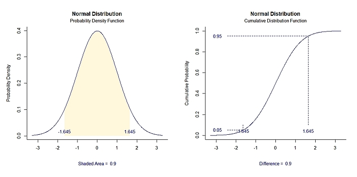

# `plotDistributions` 

## Visualizing Probability Distributions

[](https://cran.r-project.org/)
[](https://opensource.org/licenses/MIT)

### Overview

`plotDistributions` is a small R package for plotting the probability density and cumulative distribution functions for various continuous distributions. It provides functionality to highlight probabilities and display critical values. 



### Installation

This package is not currently on CRAN, but can be installed and loaded using these R commands:

``` r
if (!require(remotes)) install.packages("remotes")
remotes::install_github("cwendorf/plotDistributions")
library(plotDistributions)
```

If you do not wish a full install, the latest functions can be made available using this R command:

```r
source("http://raw.githubusercontent.com/cwendorf/plotDistributions/main/source-plotDistributions.R")
```

### Usage

This package contains a set of examples to demonstrate its use:

- [Normal Distribution Examples](./docs/NormalDistributionExamples.md)
- [Student's t Distribution Examples](./docs/StudentsDistributionExamples.md)
- [F Distribution Examples](./docs/FDistributionExamples.md)
- [Studentized Range Distribution Examples](./docs/StudentizedRangeDistributionExamples.md)
- [Chi Square Distribution Examples](./docs/ChiSquareDistributionExamples.md)

### Contact Me

- GitHub Issues: [https://github.com/cwendorf/plotDistributions/issues](https://github.com/cwendorf/plotDistributions/issues) 
- Author Email: [cwendorf@uwsp.edu](mailto:cwendorf@uwsp.edu)
- Author Homepage: [https://github.com/cwendorf](https://github.com/cwendorf)

### Citation

Wendorf, C.A. (2022). *plotDistributions: Visualizing probability distributions* [R Package]. [https://github.com/cwendorf/plotDistributions](https://github.com/cwendorf/plotDistributions)
