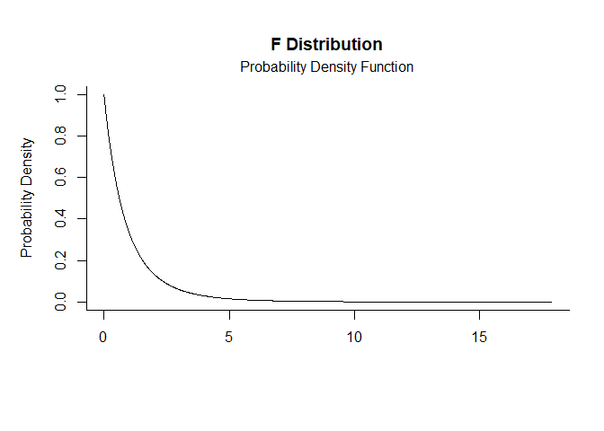
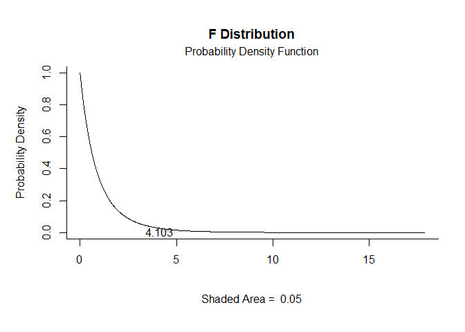
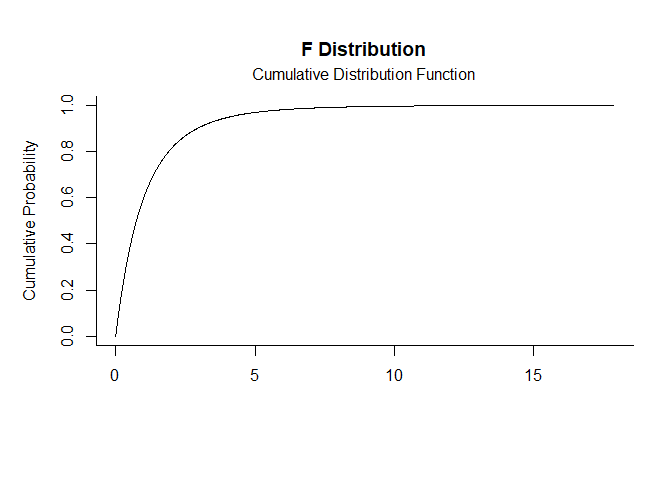
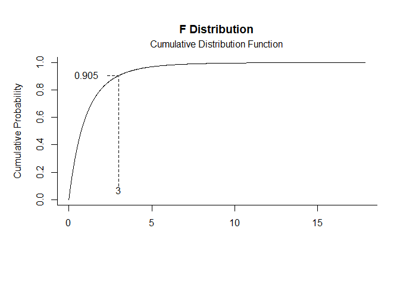
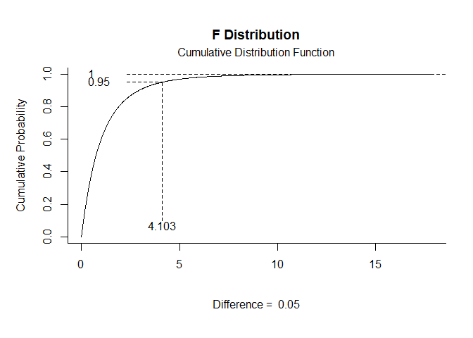

## F Distribution Examples

- [Probability Density Function](#probability-density-function)
- [Cumulative Distribution Function](#cumulative-distribution-function)

------------------------------------------------------------------------

### Probability Density Function

Get Probability Density Function plots that specify no limits, numeric
limits, and probability limits, respectively.

``` r
f.pdf(params=c(df1=2,df2=10))
```

<!-- -->

``` r
f.pdf(params=c(df1=2,df2=10),limits=c(3))
```

<!-- -->

``` r
f.pdf(params=c(df1=2,df2=10),probs=c(.95,1))
```

<!-- -->

### Cumulative Distribution Function

Get Cumulative Distribution Function plots that specify no limits,
numeric limits, and probability limits, respectively.

``` r
f.cdf(params=c(df1=2,df2=10))
```

<!-- -->

``` r
f.cdf(params=c(df1=2,df2=10),limits=c(3))
```

<!-- -->

``` r
f.cdf(params=c(df1=2,df2=10),probs=c(.95,1))
```

<!-- -->
