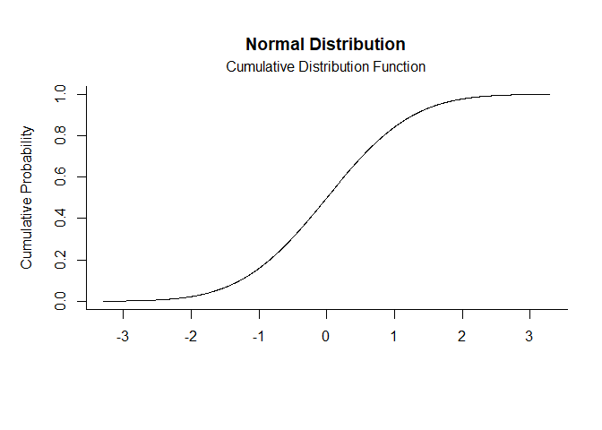
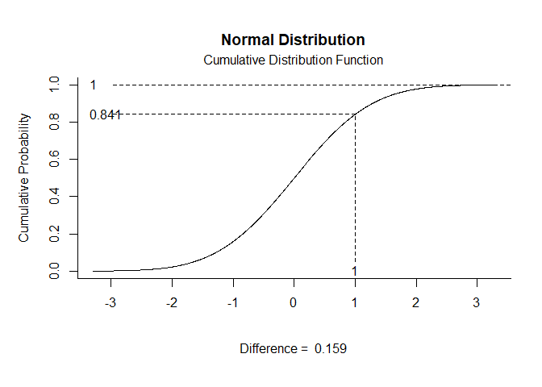
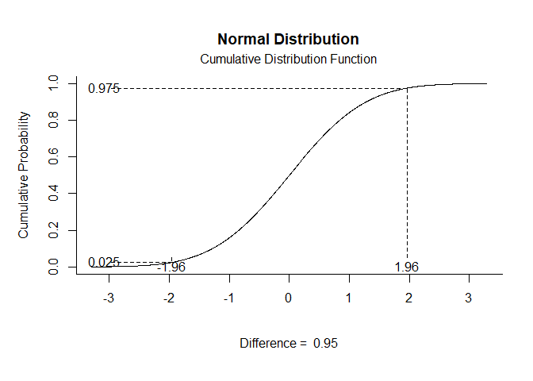

# [`plotDistributions`](https://github.com/cwendorf/plotDistributions/)

## Normal Distribution Examples

- [Probability Density Function](#probability-density-function)
- [Cumulative Distribution Function](#cumulative-distribution-function)

------------------------------------------------------------------------

### Probability Density Function

Get Probability Density Function plots that specify no limits, numeric
limits, and probability limits, respectively.

``` r
norm.pdf()
```

<!-- -->

``` r
norm.pdf(limits=c(1,Inf))
```

<!-- -->

``` r
norm.pdf(probs=c(.025,.975))
```

<!-- -->

### Cumulative Distribution Function

Get Cumulative Distribution Function plots that specify no limits,
numeric limits, and probability limits, respectively.

``` r
norm.cdf()
```

<!-- -->

``` r
norm.cdf(limits=c(1,Inf))
```

<!-- -->

``` r
norm.cdf(probs=c(.025,.975))
```

<!-- -->
