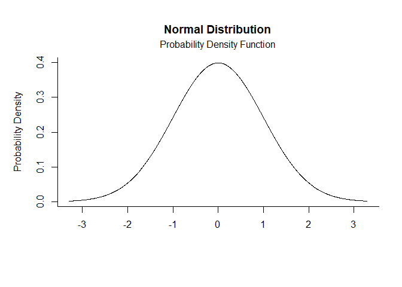
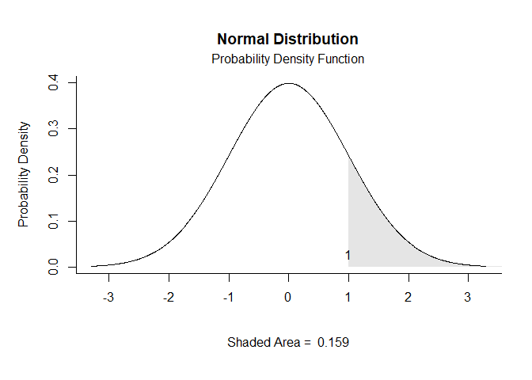
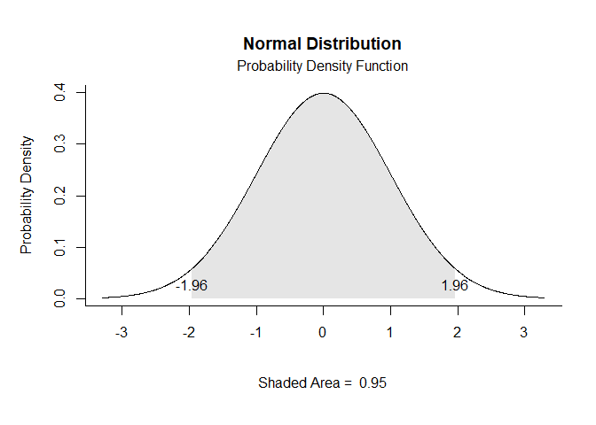
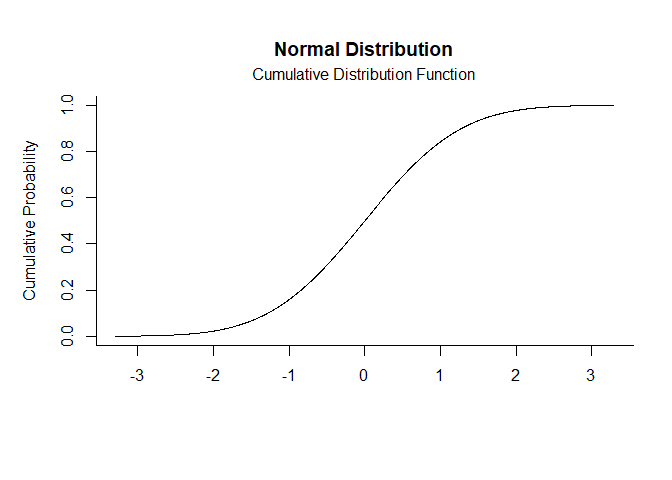
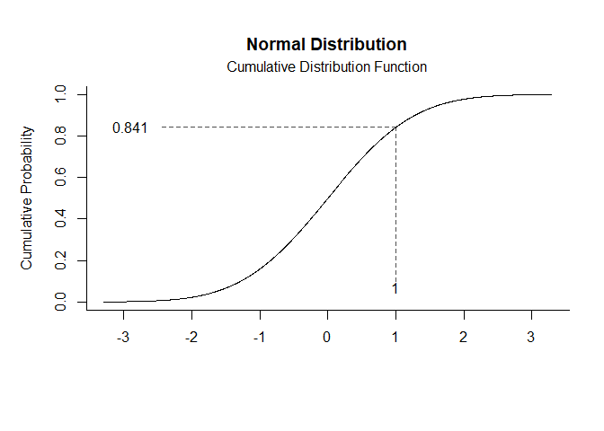
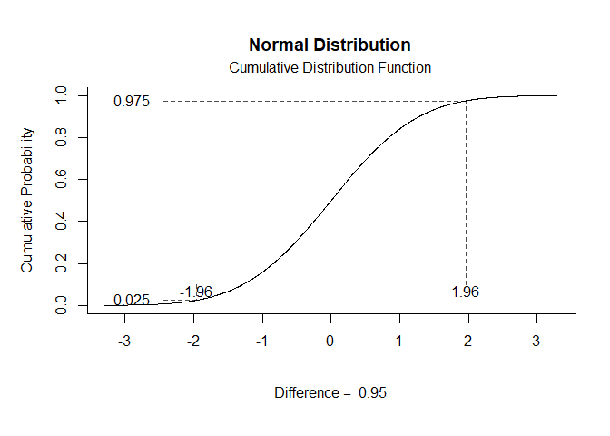

## Short Examples

### Normal Distribution

Probability Density Function plots that specify no limits, numeric limits, and probability limits, respectively.

```r
norm.pdf()
```

<!-- -->

```r
norm.pdf(limits=c(1,Inf))
```

<!-- -->

```r
norm.pdf(probs=c(.025,.975))
```

<!-- -->

Cumulative Distribution Function plots that specify no limits, numeric limits, and probability limits, respectively.

```r
norm.cdf()
```

<!-- -->

```r
norm.cdf(limits=c(1))
```

<!-- -->

```r
norm.cdf(probs=c(.025,.975))
```

<!-- -->

### Student's t Distribution

Probability Density Function plots that specify no limits, numeric limits, and probability limits, respectively.

```r
t.pdf(params=c(df=5))
t.pdf(params=c(df=5),limits=c(1))
t.pdf(params=c(df=5),probs=c(.025,.975))
```

Cumulative Distribution Function plots that specify no limits, numeric limits, and probability limits, respectively.

```r
t.cdf(params=c(df=5))
t.cdf(params=c(df=5),limits=c(2))
t.cdf(params=c(df=5),probs=c(.025,.975))
```

### F Distribution

Probability Density Function plots that specify no limits, numeric limits, and probability limits, respectively.

```r
f.pdf(params=c(df1=2,df2=10))
f.pdf(params=c(df1=2,df2=10),limits=c(3))
f.pdf(params=c(df1=2,df2=10),probs=c(.95,1))
```

Cumulative Distribution Function plots that specify no limits, numeric limits, and probability limits, respectively.

```r
f.cdf(params=c(df1=2,df2=10))
f.cdf(params=c(df1=2,df2=10),limits=c(3))
f.cdf(params=c(df1=2,df2=10),probs=c(.95,1))
```

### Studentized Range Distribution

Probability Density Function plots that specify no limits, numeric limits, and probability limits, respectively.

```r
q.pdf(params=c(nmeans=2,df=10))
q.pdf(params=c(nmeans=2,df=10),limits=c(2))
q.pdf(params=c(nmeans=2,df=10),probs=c(.95,1))
```

Cumulative Distribution Function plots that specify no limits, numeric limits, and probability limits, respectively.

```r
q.cdf(params=c(nmeans=2,df=10))
q.cdf(params=c(nmeans=2,df=10),limits=c(2))
q.cdf(params=c(nmeans=2,df=10),probs=c(.95,1))
```

### Chi Square Distribution

Probability Density Function plots that specify no limits, numeric limits, and probability limits, respectively.

```r
chisq.pdf(params=c(df=10))
chisq.pdf(params=c(df=10),limits=c(10))
chisq.pdf(params=c(df=10),probs=c(.95,1))
```

Cumulative Distribution Function plots that specify no limits, numeric limits, and probability limits, respectively.

```r
chisq.cdf(params=c(df=10))
chisq.cdf(params=c(df=10),limits=c(10))
chisq.cdf(params=c(df=10),probs=c(.95,1))
```
