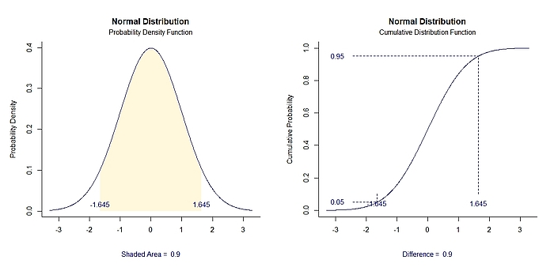

# [`plotDistributions`](https://github.com/cwendorf/plotDistributions)

## Introduction

### Overview

`plotDistributions` is a small R package for plotting the probability density and cumulative distribution functions for various continuous distributions. It provides functionality to highlight probabilities and display critical values. 

### Resources

- [Reference](./man/README.md): Documentation for all exported functions, including usage, arguments, and return values.
- [Articles](./vignettes/README.md): Examples demonstrating how to use the package.
