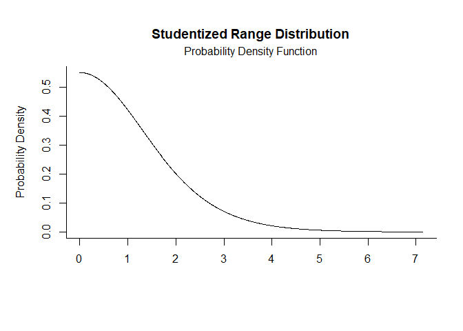
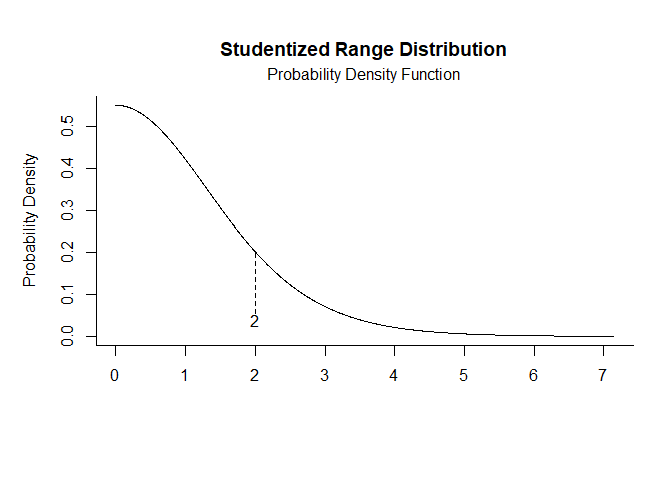
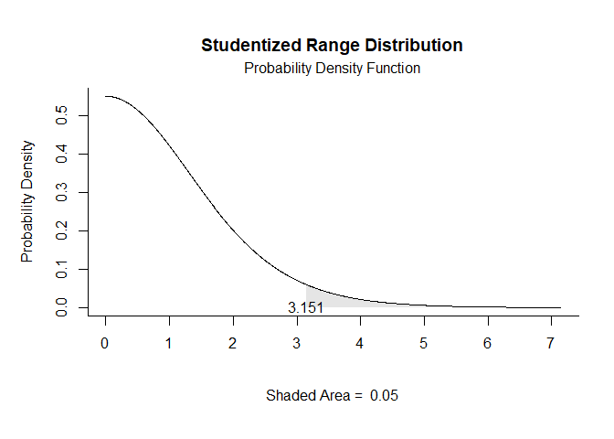
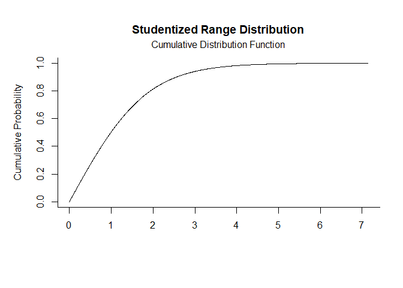
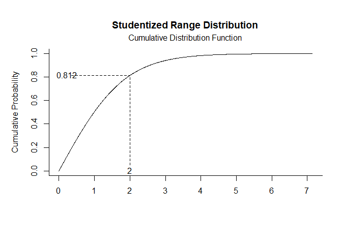
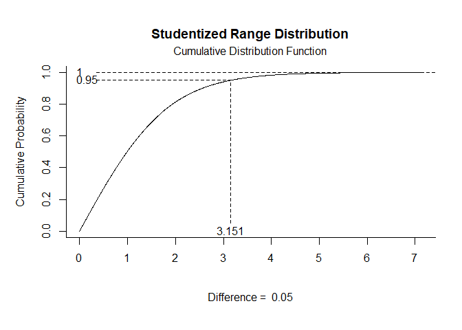

## Studentized Range Distribution Examples

### Probability Density Function

Get Probability Density Function plots that specify no limits, numeric limits, and probability limits, respectively.

```r
q.pdf(params=c(nmeans=2,df=10))
```

<!-- -->

```r
q.pdf(params=c(nmeans=2,df=10),limits=c(2))
```

<!-- -->

```r
q.pdf(params=c(nmeans=2,df=10),probs=c(.95,1))
```

<!-- -->

### Cumulative Distribution Function

Get Cumulative Distribution Function plots that specify no limits, numeric limits, and probability limits, respectively.

```r
q.cdf(params=c(nmeans=2,df=10))
```

<!-- -->

```r
q.cdf(params=c(nmeans=2,df=10),limits=c(2))
```

<!-- -->

```r
q.cdf(params=c(nmeans=2,df=10),probs=c(.95,1))
```

<!-- -->
