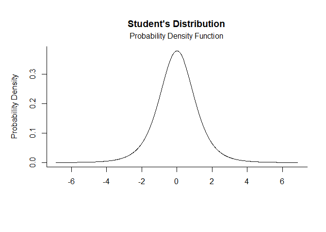
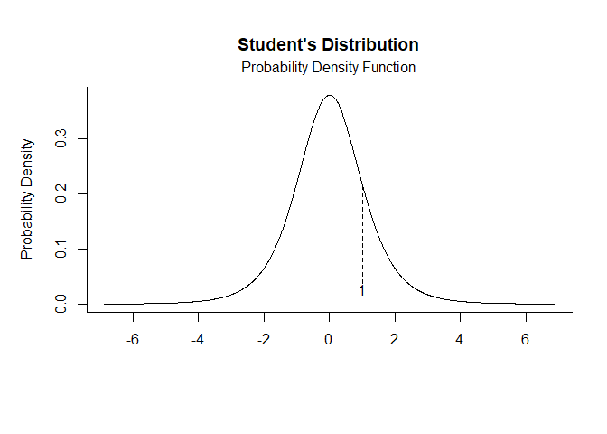
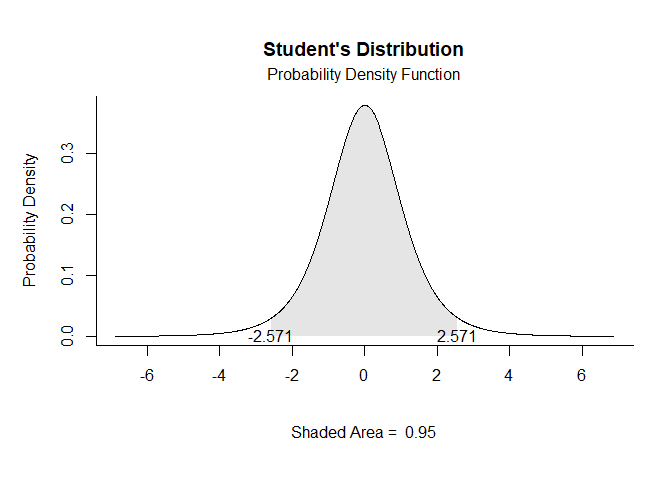
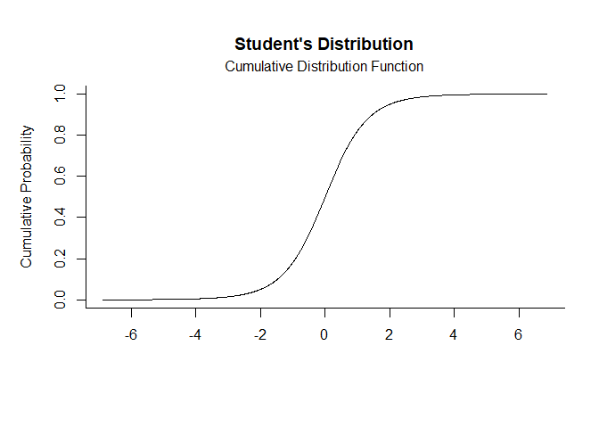
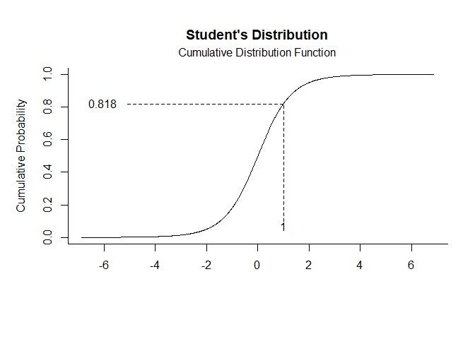
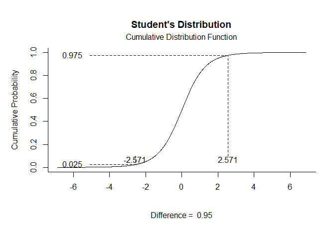

# [`plotDistributions`](https://github.com/cwendorf/plotDistributions/)

## Student’s t Distribution Examples

- [Probability Density Function](#probability-density-function)
- [Cumulative Distribution Function](#cumulative-distribution-function)

------------------------------------------------------------------------

### Probability Density Function

Get Probability Density Function plots that specify no limits, numeric
limits, and probability limits, respectively.

``` r
t.pdf(params=c(df=5))
```

<!-- -->

``` r
t.pdf(params=c(df=5),limits=c(1))
```

<!-- -->

``` r
t.pdf(params=c(df=5),probs=c(.025,.975))
```

<!-- -->

### Cumulative Distribution Function

Get Cumulative Distribution Function plots that specify no limits,
numeric limits, and probability limits, respectively.

``` r
t.cdf(params=c(df=5))
```

<!-- -->

``` r
t.cdf(params=c(df=5),limits=c(1))
```

<!-- -->

``` r
t.cdf(params=c(df=5),probs=c(.025,.975))
```

<!-- -->
