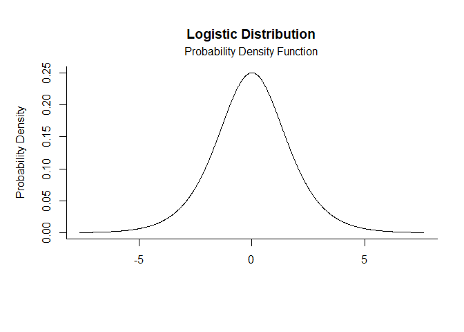
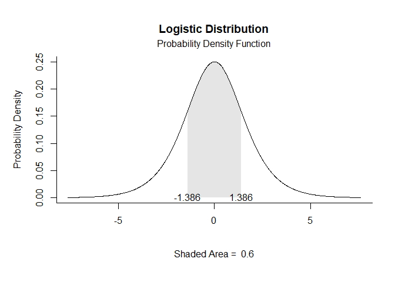
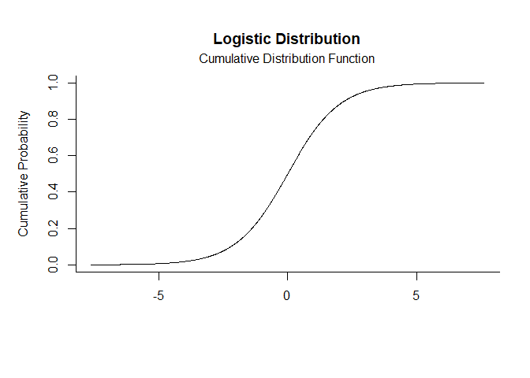
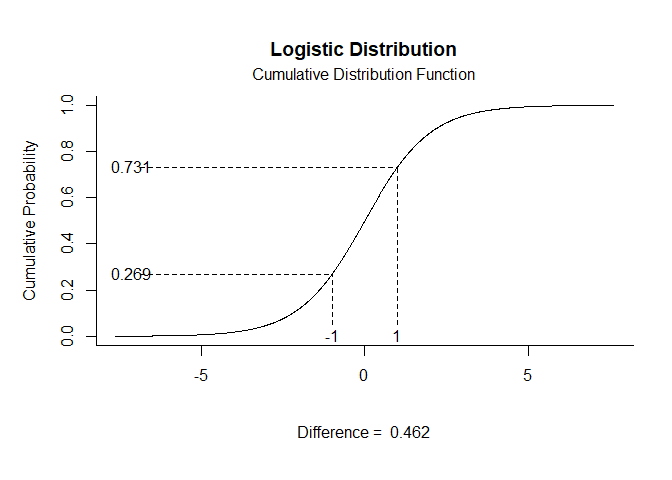
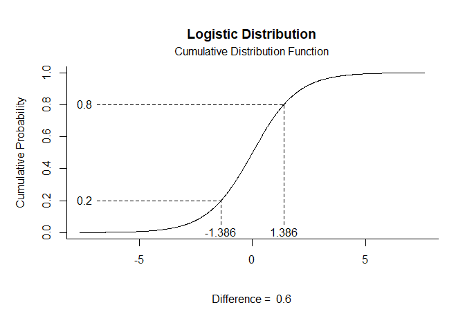

# [`plotDistributions`](https://github.com/cwendorf/plotDistributions/)

## Logistic Distribution Examples

- [Probability Density Function](#probability-density-function)
- [Cumulative Distribution Function](#cumulative-distribution-function)

------------------------------------------------------------------------

### Probability Density Function

Get Probability Density Function plots that specify no limits, numeric
limits, and probability limits, respectively.

``` r
logis.pdf(params = c(location = 0, scale = 1))
```

<!-- -->

``` r
logis.pdf(params = c(location = 0, scale = 1), limits = c(-1, 1))
```

<!-- -->

``` r
logis.pdf(params = c(location = 0, scale = 1), probs = c(.2, .8))
```

<!-- -->

### Cumulative Distribution Function

Get Cumulative Distribution Function plots that specify no limits,
numeric limits, and probability limits, respectively.

``` r
logis.cdf(params = c(location = 0, scale = 1))
```

<!-- -->

``` r
logis.cdf(params = c(location = 0, scale = 1), limits = c(-1, 1))
```

<!-- -->

``` r
logis.cdf(params = c(location = 0, scale = 1), probs = c(.2, .8))
```

<!-- -->
