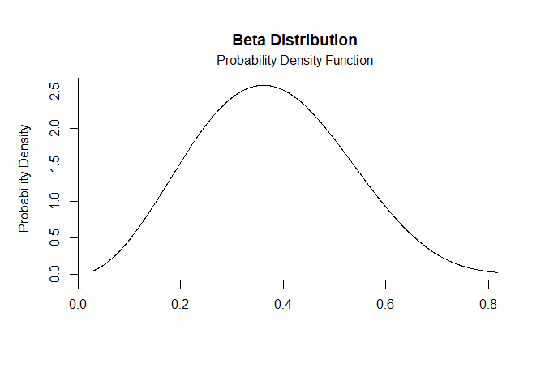
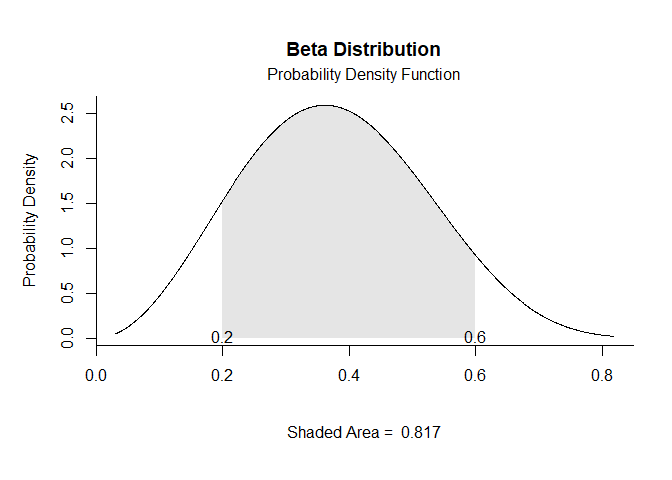
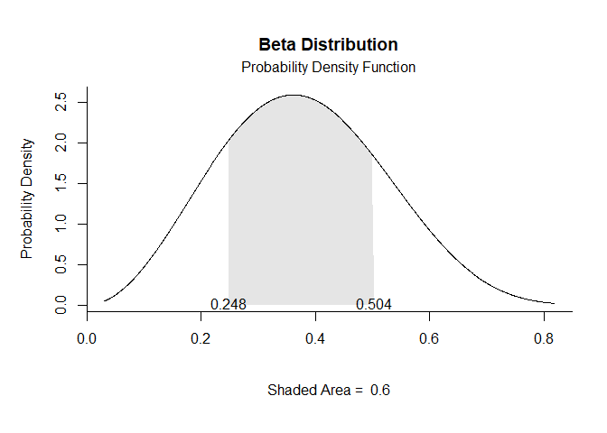
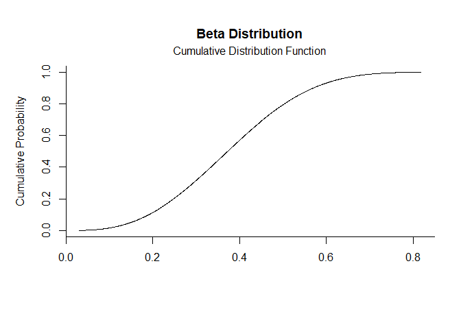
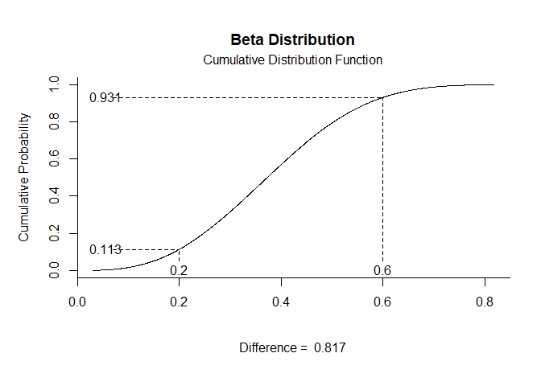
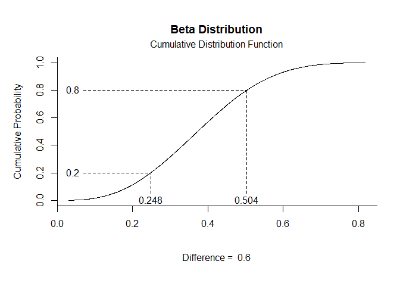

# [`plotDistributions`](https://github.com/cwendorf/plotDistributions/)

## Noncentral Beta Distribution Examples

- [Probability Density Function](#probability-density-function)
- [Cumulative Distribution Function](#cumulative-distribution-function)

------------------------------------------------------------------------

In these examples, `ncp` is the noncentrality parameter. When `ncp = 0`,
the distribution reduces to the usual beta distribution, so the
noncentral form is useful when you want to compare a central case
against one with an added noncentral effect. For fixed `shape1` and
`shape2`, increasing `ncp` pulls more density toward larger values on
the 0 to 1 scale, which changes both the location and the skew of the
curve.

### Probability Density Function

Get noncentral beta Probability Density Function plots using `ncp` in
`params`.

``` r
beta.pdf(params = c(shape1 = 3, shape2 = 8, ncp = 4))
```

<!-- -->

``` r
beta.pdf(params = c(shape1 = 3, shape2 = 8, ncp = 4), limits = c(.2, .6))
```

<!-- -->

``` r
beta.pdf(params = c(shape1 = 3, shape2 = 8, ncp = 4), probs = c(.2, .8))
```

<!-- -->

### Cumulative Distribution Function

Get noncentral beta Cumulative Distribution Function plots using `ncp`
in `params`.

``` r
beta.cdf(params = c(shape1 = 3, shape2 = 8, ncp = 4))
```

<!-- -->

``` r
beta.cdf(params = c(shape1 = 3, shape2 = 8, ncp = 4), limits = c(.2, .6))
```

<!-- -->

``` r
beta.cdf(params = c(shape1 = 3, shape2 = 8, ncp = 4), probs = c(.2, .8))
```

<!-- -->
