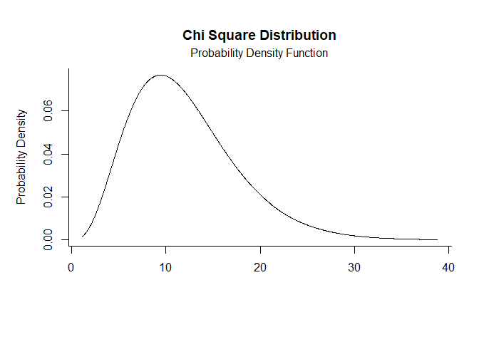
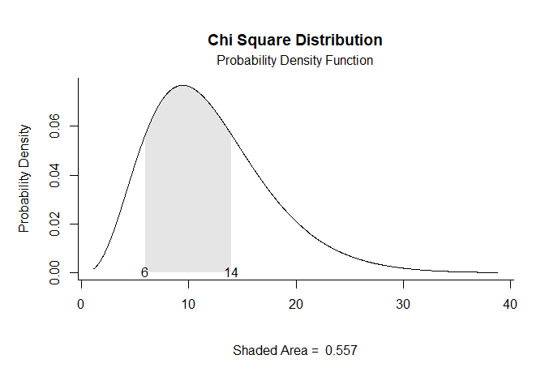
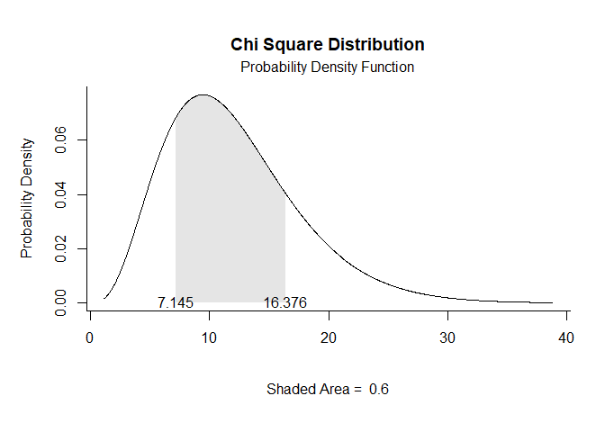
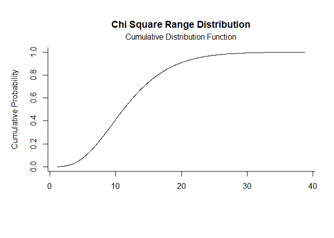
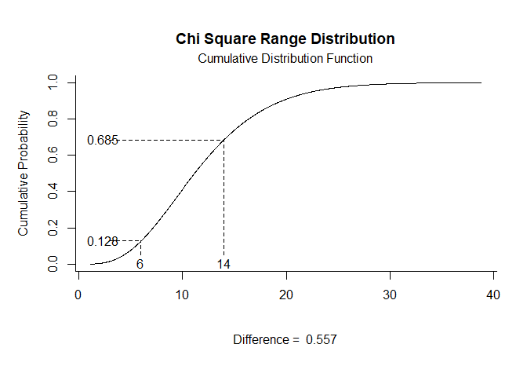
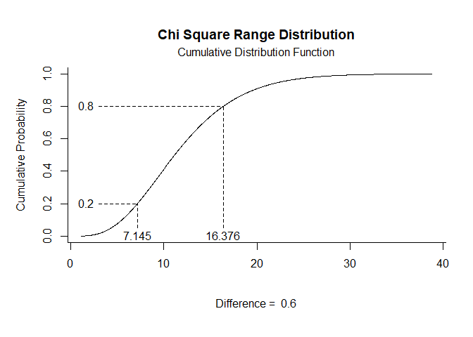

# [`plotDistributions`](https://github.com/cwendorf/plotDistributions/)

## Noncentral Chi-Square Distribution Examples

- [Probability Density Function](#probability-density-function)
- [Cumulative Distribution Function](#cumulative-distribution-function)

------------------------------------------------------------------------

In these examples, `ncp` is the noncentrality parameter. When `ncp = 0`,
the distribution reduces to the usual chi-square distribution. As `ncp`
increases, the curve shifts to the right and becomes more spread out, so
the noncentral version is useful when the central chi-square assumption
is no longer appropriate.

### Probability Density Function

Get noncentral chi-square Probability Density Function plots using `ncp`
in `params`.

``` r
chisq.pdf(params = c(df = 8, ncp = 4))
```

<!-- -->

``` r
chisq.pdf(params = c(df = 8, ncp = 4), limits = c(6, 14))
```

<!-- -->

``` r
chisq.pdf(params = c(df = 8, ncp = 4), probs = c(.2, .8))
```

<!-- -->

### Cumulative Distribution Function

Get noncentral chi-square Cumulative Distribution Function plots using
`ncp` in `params`.

``` r
chisq.cdf(params = c(df = 8, ncp = 4))
```

<!-- -->

``` r
chisq.cdf(params = c(df = 8, ncp = 4), limits = c(6, 14))
```

<!-- -->

``` r
chisq.cdf(params = c(df = 8, ncp = 4), probs = c(.2, .8))
```

<!-- -->
