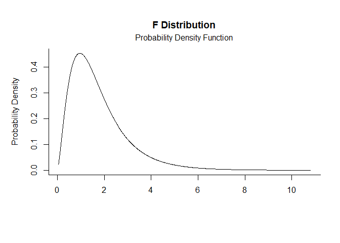
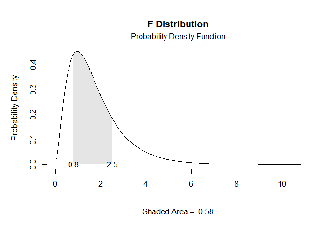
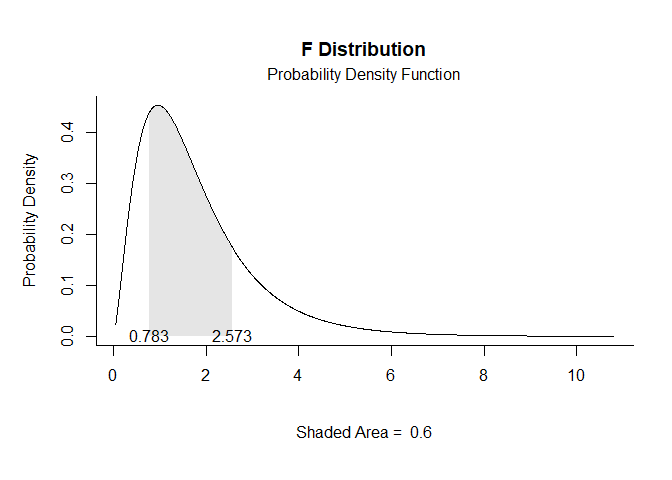
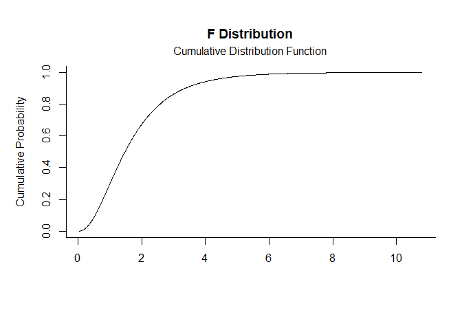
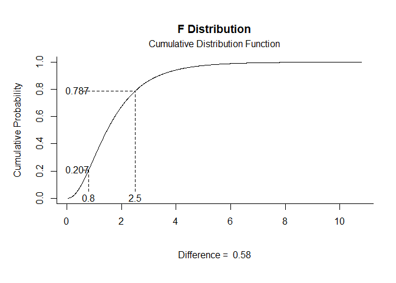
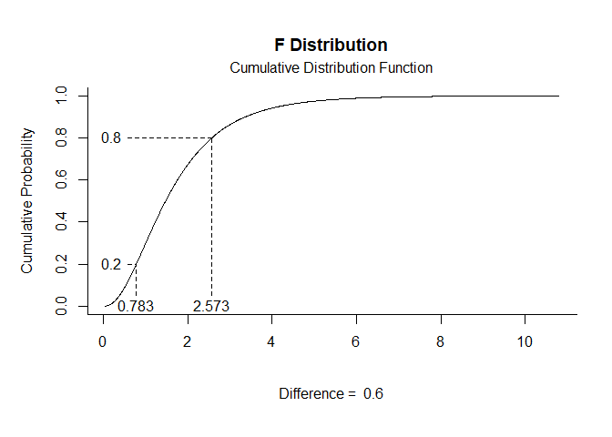

# [`plotDistributions`](https://github.com/cwendorf/plotDistributions/)

## Noncentral F Distribution Examples

- [Probability Density Function](#probability-density-function)
- [Cumulative Distribution Function](#cumulative-distribution-function)

------------------------------------------------------------------------

In these examples, `ncp` is the noncentrality parameter. When `ncp = 0`,
the distribution reduces to the usual F distribution. For fixed `df1`
and `df2`, larger `ncp` values move more probability toward larger F
values and typically make the right tail more pronounced, which is why
the noncentral form is often used when a numerator effect is present.

### Probability Density Function

Get noncentral F Probability Density Function plots using `ncp` in
`params`.

``` r
f.pdf(params = c(df1 = 5, df2 = 20, ncp = 3))
```

<!-- -->

``` r
f.pdf(params = c(df1 = 5, df2 = 20, ncp = 3), limits = c(.8, 2.5))
```

<!-- -->

``` r
f.pdf(params = c(df1 = 5, df2 = 20, ncp = 3), probs = c(.2, .8))
```

<!-- -->

### Cumulative Distribution Function

Get noncentral F Cumulative Distribution Function plots using `ncp` in
`params`.

``` r
f.cdf(params = c(df1 = 5, df2 = 20, ncp = 3))
```

<!-- -->

``` r
f.cdf(params = c(df1 = 5, df2 = 20, ncp = 3), limits = c(.8, 2.5))
```

<!-- -->

``` r
f.cdf(params = c(df1 = 5, df2 = 20, ncp = 3), probs = c(.2, .8))
```

<!-- -->
