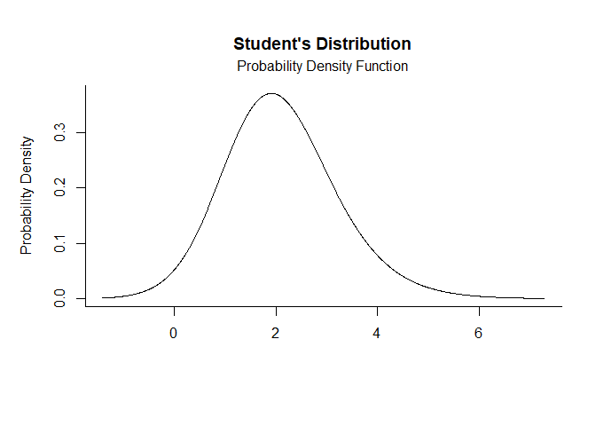
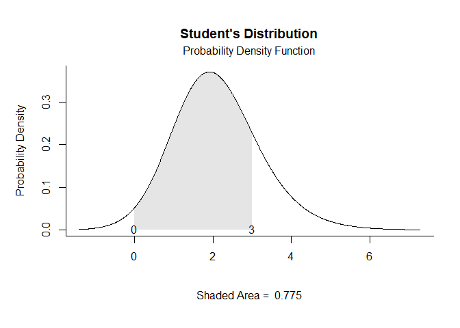
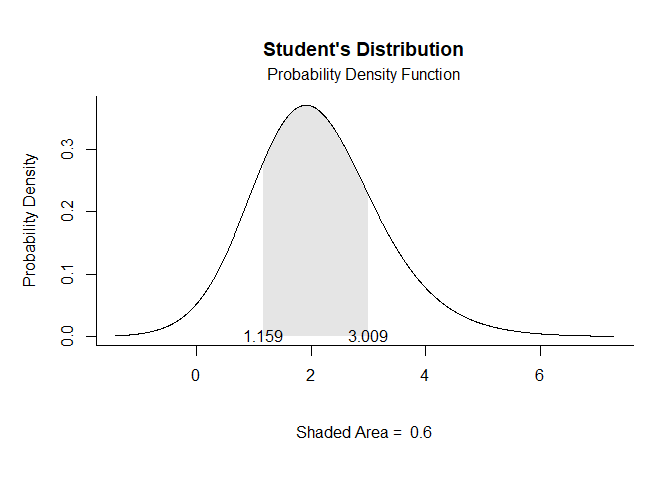
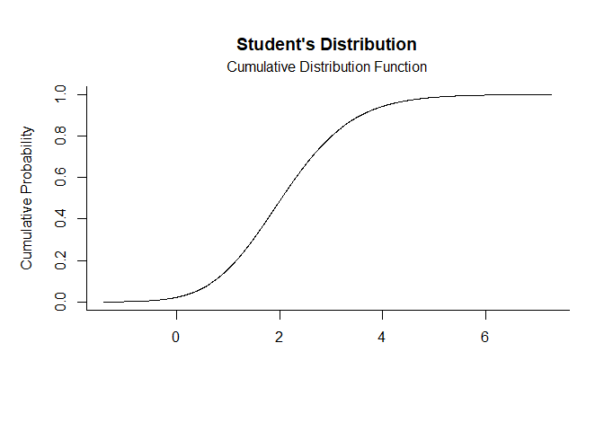
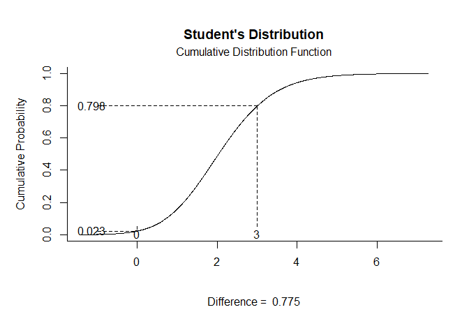
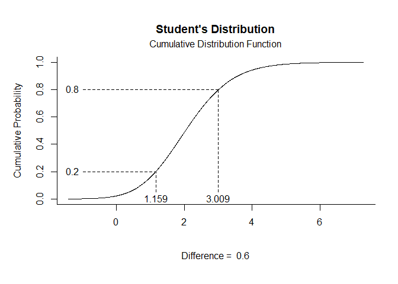

# [`plotDistributions`](https://github.com/cwendorf/plotDistributions/)

## Noncentral Student’s t Distribution Examples

- [Probability Density Function](#probability-density-function)
- [Cumulative Distribution Function](#cumulative-distribution-function)

------------------------------------------------------------------------

In these examples, `ncp` is the noncentrality parameter. When `ncp = 0`,
the distribution reduces to the usual Student’s t distribution. Positive
`ncp` values shift the distribution to the right, negative values shift
it to the left, and larger absolute values of `ncp` make the
distribution more asymmetric, so `ncp` controls both location and shape.

### Probability Density Function

Get noncentral Student’s t Probability Density Function plots using
`ncp` in `params`.

``` r
t.pdf(params = c(df = 15, ncp = 2))
```

<!-- -->

``` r
t.pdf(params = c(df = 15, ncp = 2), limits = c(0, 3))
```

<!-- -->

``` r
t.pdf(params = c(df = 15, ncp = 2), probs = c(.2, .8))
```

<!-- -->

### Cumulative Distribution Function

Get noncentral Student’s t Cumulative Distribution Function plots using
`ncp` in `params`.

``` r
t.cdf(params = c(df = 15, ncp = 2))
```

<!-- -->

``` r
t.cdf(params = c(df = 15, ncp = 2), limits = c(0, 3))
```

<!-- -->

``` r
t.cdf(params = c(df = 15, ncp = 2), probs = c(.2, .8))
```

<!-- -->
