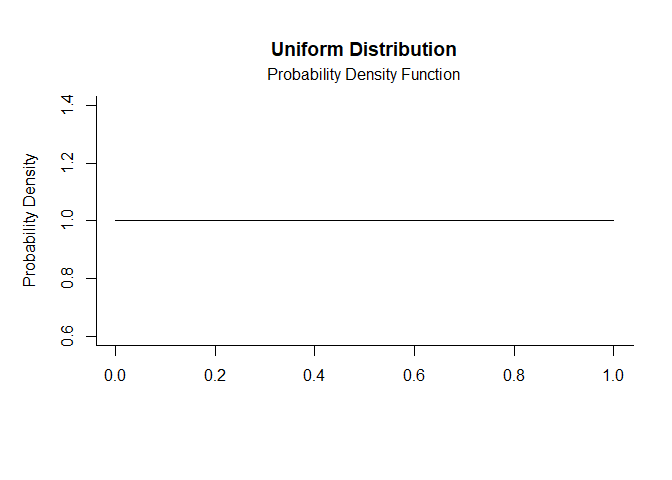
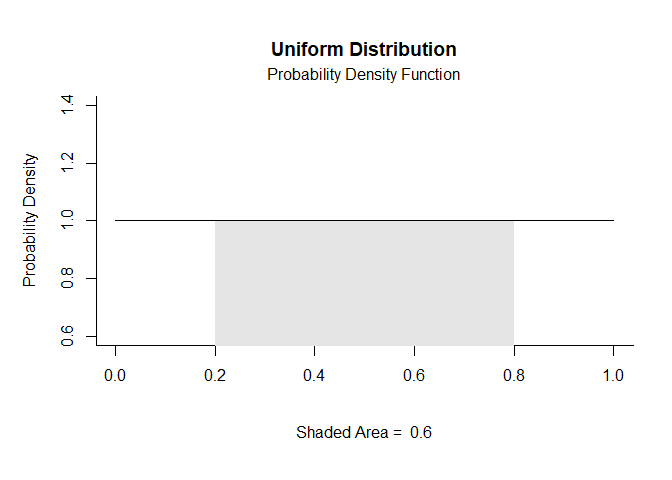
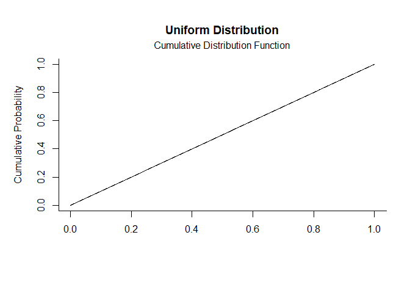
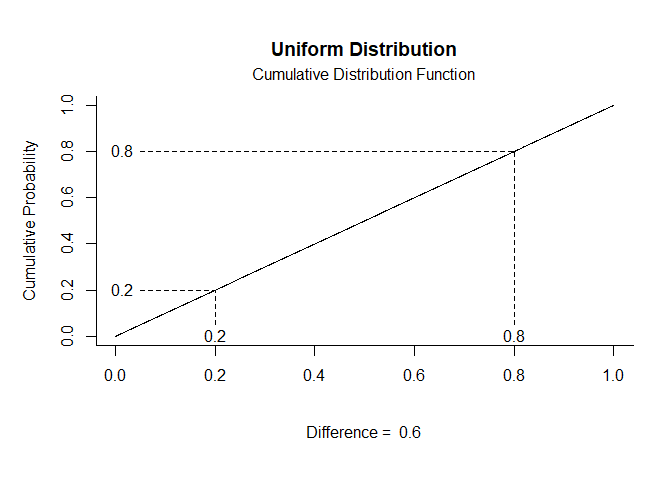

# [`plotDistributions`](https://github.com/cwendorf/plotDistributions/)

## Uniform Distribution Examples

- [Probability Density Function](#probability-density-function)
- [Cumulative Distribution Function](#cumulative-distribution-function)

------------------------------------------------------------------------

### Probability Density Function

Get Probability Density Function plots that specify no limits, numeric
limits, and probability limits, respectively.

``` r
unif.pdf(params = c(min = 0, max = 1))
```

<!-- -->

``` r
unif.pdf(params = c(min = 0, max = 1), limits = c(.2, .8))
```

<!-- -->

``` r
unif.pdf(params = c(min = 0, max = 1), probs = c(.2, .8))
```

### Cumulative Distribution Function

Get Cumulative Distribution Function plots that specify no limits,
numeric limits, and probability limits, respectively.

``` r
unif.cdf(params = c(min = 0, max = 1))
```

<!-- -->

``` r
unif.cdf(params = c(min = 0, max = 1), limits = c(.2, .8))
```

<!-- -->

``` r
unif.cdf(params = c(min = 0, max = 1), probs = c(.2, .8))
```
